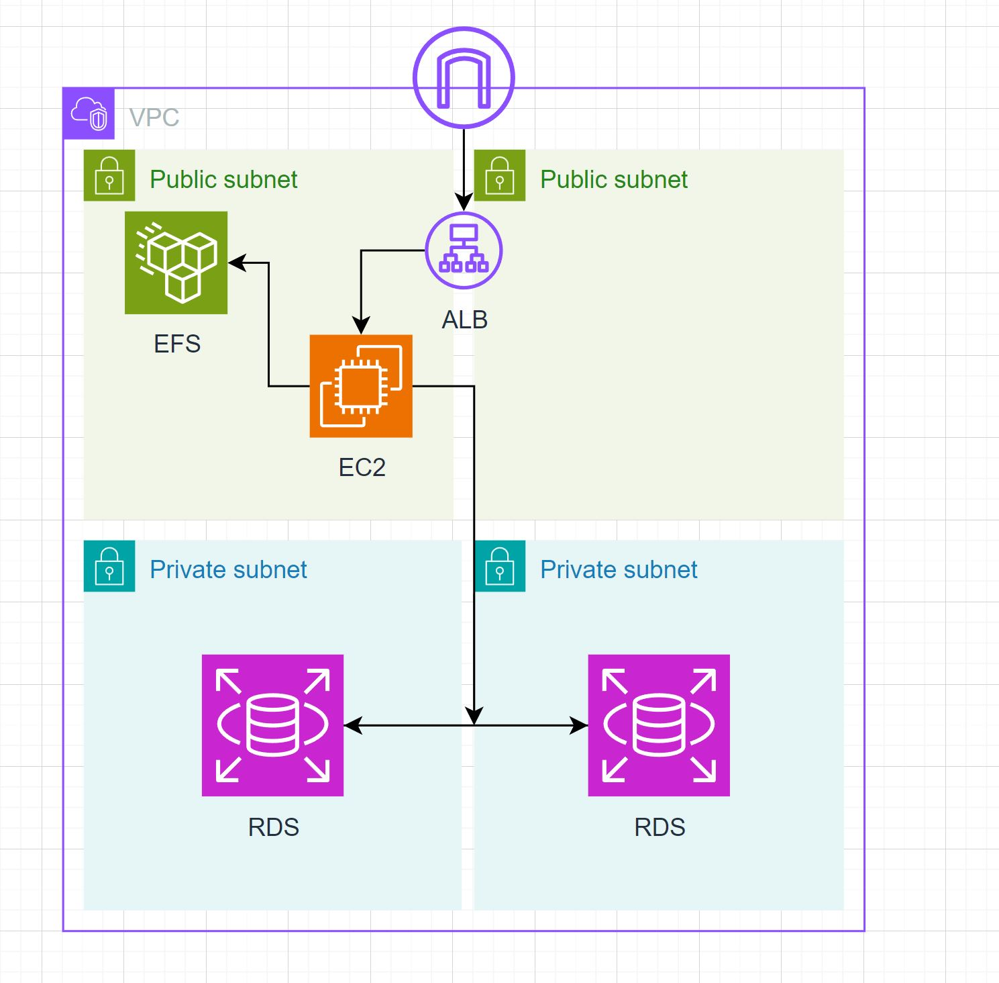

# WordPress Automation Project

This project automates the deployment of a WordPress site using a CI/CD pipeline. The infrastructure is provisioned on AWS using Terraform, and the configuration of the WordPress site is managed with Ansible. GitHub Actions is used to orchestrate the entire pipeline.

## Table of Contents

- [Project Overview](#project-overview)
- [Prerequisites](#prerequisites)
- [Architecture](#architecture)
  - [Terraform](#terraform)
  - [Ansible](#Ansible)
  - [GitHub Actions](@githubactions)
- [Setup](#setup)
  - [Clone the Repository](#clone-the-repository)
  - [Configure AWS](#configure-aws)
  - [Set Up GitHub Secrets](#set-up-github-secrets)
  - [Run the Pipeline](#run-the-pipeline)
- [Verification](#verification)
- [Troubleshooting](#troubleshooting)
- [Contributing](#contributing)
- [License](#license)

## Project Overview

This project aims to automate the end-to-end deployment of a WordPress site. It includes:

- **Infrastructure as Code (IaC)**: Using Terraform to provision AWS resources.
- **Configuration Management**: Using Ansible to configure WordPress.
- **Continuous Integration/Continuous Deployment (CI/CD)**: Using GitHub Actions to automate the workflow.

### Terraform

Terraform will create the architecture in AWS that is needed for Wordpress to run. This includes a VPC with public and private subnets, security groups, Application Load Balancer, EC2 Instance, Elastic File Share, and Relational Database Service. Visit the 'terraform' directory and view main.tf for more details.

### Ansible

Ansible is the tool we will use for configuration management. It is essentially what will connect to our EC2 instance and install Wordpress. You can view setup.yml in the 'ansible' directory to see the playbook.

- Installing Apache, PHP, and necessary extensions.
- Downloading and configuring WordPress.
- Setting up EFS for shared storage.
- Connecting to RDS for the database.

### GitHub Actions

GitHub Actions is used as the CI/CD pipeline tool. It is what logs into AWS and then runs our Terraform and Ansible configurations automatically upon pushing the code into your own repo. You can view the 'workflow.yml' file in .github/workflows to see it in detail. There is also a 'destroy.yml' file you can run manually in case you want to destroy your infrastructure.